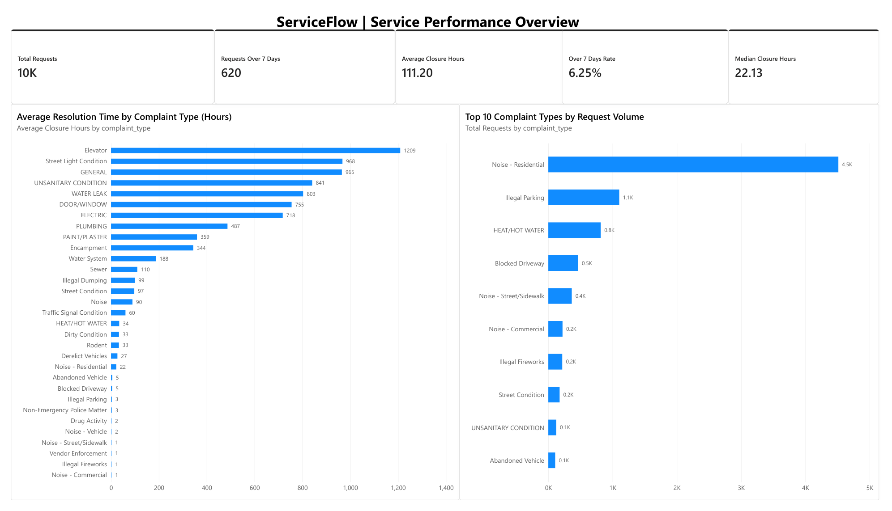
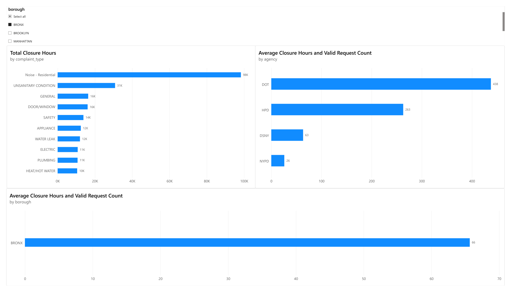
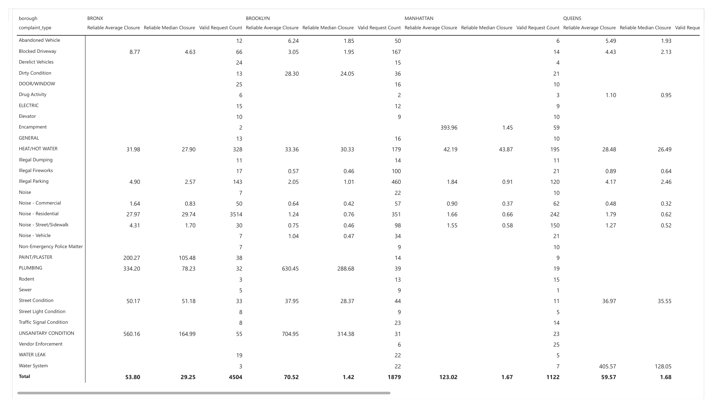
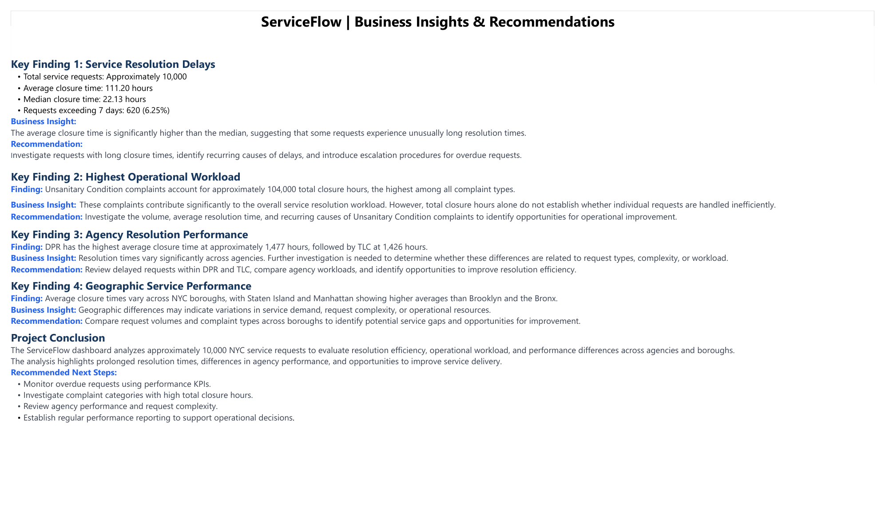

# ServiceFlow Analytics

**NYC Service Request Analysis | Power BI · Business Intelligence · Business-Focused Analysis**

## Project Overview

ServiceFlow Analytics analyzes approximately 10,000 New York City service requests to examine closure times, workload, and differences across complaint categories, agencies, and boroughs. I developed a four-page Power BI report using Power Query and DAX to identify performance patterns and suggest areas for further investigation.

This is an **independent descriptive analytics project**. Recommendations are proposals, not changes implemented by NYC311.

## Business Questions

- How long does it typically take to close a service request?
- Which complaint categories contribute the most total closure hours?
- How do closure times vary by agency and borough?
- Which patterns warrant closer operational investigation?

## Tools

- **Power BI Desktop:** Interactive report design and visualizations
- **Power Query:** Data preparation and transformation
- **DAX:** Closure-time metrics and KPI measures
- **Business-focused analysis:** Findings, interpretation, and recommendations

## Key Performance Indicators

| KPI | Result |
| --- | ---: |
| Requests analyzed | Approximately 10,000 |
| Average closure time | 111.20 hours |
| Median closure time | 22.13 hours |
| Requests over seven days | 620 |
| Over-seven-day rate | 6.25% |

## Dashboard Pages

1. **Service Performance Overview:** Overall KPIs, complaint volumes, and average closure times.
2. **Operational Analysis:** Closure-time and workload comparisons by complaint type, agency, and borough.
3. **Detailed Performance Analysis:** Borough-by-complaint matrix with mean, median, and valid request counts. (The current Power BI page may still display the title *Root Cause Analysis*; the matrix describes differences, not verified causes.)
4. **Business Insights & Recommendations:** Findings and recommended next investigations.

## Selected Findings

**Longer-running cases influence the average.** Average closure time (111.20h) is substantially higher than the median (22.13h). This indicates a right-skewed distribution; it does not identify why individual requests take longer.

**Unsanitary Condition is a substantial workload contributor.** The project report identifies approximately 104,000 total closure hours for this category. Total closure hours reflect both case volume and duration, so they should not be interpreted alone as inefficiency.

**Agency averages vary.** The report identifies DPR (~1,477h) and TLC (~1,426h) as high-average agencies. These comparisons should be interpreted alongside request types, counts, and complexity before evaluating operational performance.

**Borough differences warrant closer examination.** The report notes higher observed averages in Staten Island and Manhattan than in Brooklyn and the Bronx. Category mix and sample sizes may influence these differences.

## Recommendations

- Investigate requests with unusually long closure times and examine recurring patterns.
- Compare high-total-closure-hour categories using both request volume and typical closure time.
- Review agency comparisons alongside request type, count, and complexity.
- Examine borough-level differences by complaint category before proposing resource changes.
- Monitor mean, median, and over-seven-day closure rates together.

**Interpretation note:** The analysis is descriptive. It does not demonstrate internal process failures, identify confirmed root causes, or measure improvements after intervention. Seven days is an analytical threshold here, not a claimed official service-level agreement.

## Dashboard Screenshots

## Project Files

- [Power BI dashboard](ServiceFlow_Dashboard.pbix)
- [Original four-page dashboard export](ServiceFlow_Report.pdf)
- [Enhanced project report with executive overview](ServiceFlow_Enhanced_Project_Report.pdf)

## Author

**Meshal Al Qunfith**  
Information Systems | Business Analysis & Business Intelligence
